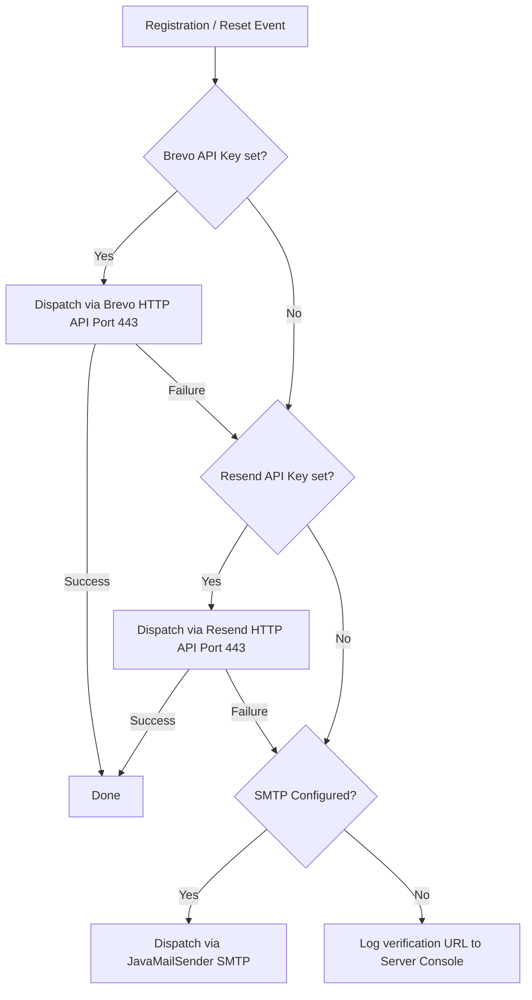

# 09 - Email Delivery Setup (SMTP, Brevo & Resend)

## Multi-Tier Failover Architecture

CarSharePro uses an asynchronous non-blocking email dispatcher with automatic failover across 3 delivery methods:



---

## 1. Gmail SMTP Configuration

1. In your Google Account, enable **2-Step Verification**.
2. Go to **Security** -> **App Passwords**.
3. Generate a 16-character App Password for "DriveShare".
4. Configure in `backend/.env`:
   ```bash
   MAIL_HOST=smtp.gmail.com
   MAIL_PORT=587
   MAIL_USERNAME=your-email@gmail.com
   MAIL_PASSWORD=your_16_char_app_password
   MAIL_FROM=no-reply@yourdomain.com
   ```

---

## 2. Brevo HTTP API (Port 443 HTTPS - Recommended for Cloud Deployments)

Cloud platforms like Render or AWS often throttle standard SMTP ports 25, 465, and 587. Brevo HTTP REST API works over port 443 HTTPS:
1. Sign up at [brevo.com](https://www.brevo.com).
2. Generate an API Key under **SMTP & API**.
3. Configure in `backend/.env`:
   ```bash
   BREVO_API_KEY=xkeysib-...
   BREVO_SENDER_EMAIL=your-verified-email@yourdomain.com
   BREVO_SENDER_NAME=DriveShare Car Rental
   ```

---

## 3. Local Development Zero-Setup Fallback

In local development without email credentials, the direct verification URL is automatically printed directly to the Spring Boot console output, allowing immediate 1-click verification testing.
