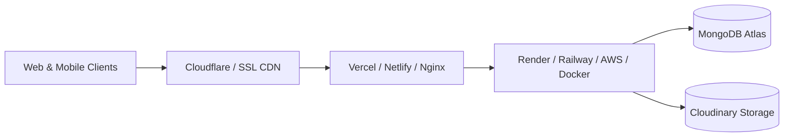

# 17 - Production Deployment Guide

## Deployment Architectures



---

## 1. Deploy Backend on Render / Railway / Heroku

1. **New Web Service**: Connect your Git repository.
2. **Root Directory**: `backend`
3. **Environment**: Java 17+ (or Docker via `backend/Dockerfile`).
4. **Build Command**: `./mvnw clean package -DskipTests`
5. **Start Command**: `java -jar target/carpvt-0.0.1-SNAPSHOT.jar`
6. **Environment Variables**:
   - `MONGODB_URI`: Your MongoDB Atlas URI
   - `JWT_SECRET`: 256-bit secret key
   - `FRONTEND_URL`: Your production frontend domain (e.g. `https://driveshare.yourdomain.com`)
   - `CLOUDINARY_CLOUD_NAME`, `CLOUDINARY_API_KEY`, `CLOUDINARY_API_SECRET`
   - `PAYMENT_UPI_ID`, `PAYMENT_UPI_NAME`

---

## 2. Deploy Frontend on Vercel / Netlify

1. **Import Repository**: Connect your Git repository.
2. **Root Directory**: `frontend`
3. **Framework Preset**: Vite
4. **Build Command**: `npm run build`
5. **Output Directory**: `dist`
6. **Environment Variables**:
   - `VITE_API_BASE_URL`: `https://api.yourdomain.com` (Your backend production URL)

---

## 3. Docker Deployment (Single Server / VPS)

Both `backend/Dockerfile` and `frontend/Dockerfile` are included for Docker containerization.

Run with Docker:
```bash
# Build Backend Container
cd backend
docker build -t carsharepro-backend .
docker run -d -p 8081:8081 --env-file .env --name carsharepro-backend carsharepro-backend

# Build Frontend Container
cd ../frontend
docker build -t carsharepro-frontend .
docker run -d -p 80:80 --name carsharepro-frontend carsharepro-frontend
```
