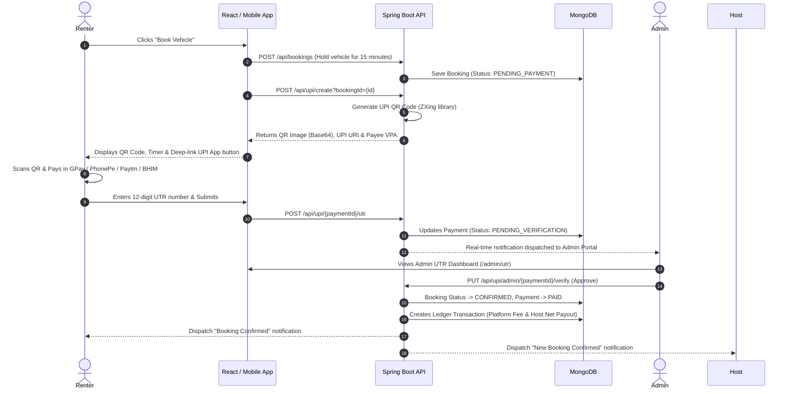

# UPI Payment Workflow & Verification Guide

DriveShare includes an end-to-end **UPI QR Code + Unique Transaction Reference (UTR) Verification** payment system tailored for Indian & digital payments with zero transaction commission overhead.

---

## Workflow Overview



---

## Configuration Settings

Configure your merchant or business UPI receiving credentials in `application.properties` or environment variables:

```bash
# Virtual Payment Address (VPA) receiving customer payments
# Formats: merchant@okhdfcbank, business@paytm, brand@upi
PAYMENT_UPI_ID=yourbusiness@upi

# Registered Display Name shown inside customer UPI applications
PAYMENT_UPI_NAME=DriveShare Car Rental
```

---

## Key Features & Security Protections

1. **15-Minute Reservation Locks**: When a booking is created, the system places a temporary 15-minute hold on the vehicle dates so other users cannot double-book. If payment is not submitted before expiry, the hold automatically releases.
2. **Dynamic UPI URI Protocol**: Generated URI follows the official NPCI UPI Deep-linking standard:
   ```text
   upi://pay?pa=yourbusiness@upi&pn=DriveShare+Car+Rental&am=4200.00&cu=INR&tn=Car+Rental+Booking+65a12b...
   ```
3. **Native UPI App Intent Launching**: Mobile users can click the "Open in Installed UPI App" button to seamlessly trigger Google Pay, PhonePe, Paytm, or BHIM on their Android/iOS device with amount and recipient prefilled.
4. **Duplicate UTR Prevention**: The backend verifies that the submitted UTR is unique across the entire database to prevent duplicate payment claims.
5. **Ledger Transaction Recording**: On admin approval, an automated transaction entry is registered computing platform commission (15%) and host earnings (85%).
